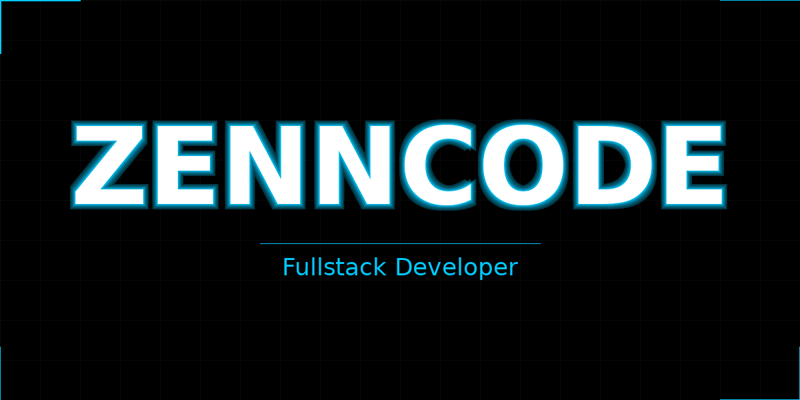

  

<!-- <h1 align="center">Hi 👋, I'm ZENNCODE</h1>
<h3 align="center">A passionate fulstack developer. </h3> -->

  

 

 
  🔭 I'm currently an Intern diving into real-world projects.  
  👨‍💻 Creating apps that make life easier and more fun.  
  🚀 Passionate about clean code and smooth user experiences.  
  💡 Always learning, experimenting, and solving problems.  
  📫 Reach me at <strong>zenjanarce8@gmail.com</strong> anytime! 

 

<h3 align="center">🔗 Connect with me</h3>

  
  
  

---

<h2 align="center">🛠️ Tech Stack</h2>

<h3 align="center">🧑‍💻 Programming Languages</h3>

  

<h3 align="center">🌐 Frontend & Frameworks</h3>

  

<h3 align="center">⚙️ Backend & Runtime</h3>

  

<h3 align="center">📱 Mobile Development</h3>

  

<h3 align="center">🗄️ Databases</h3>

  

<h3 align="center">🛠️ Tools & Platforms</h3>

  

<h3 align="center">🎨 Design & Editing Tools</h3>

  

<h3 align="center">💻 Code Editors & IDEs</h3>

  

<h3 align="center">🤖 AI</h3>

  

<!--
---

 <h2 align="center">🏗️ Company Project (OJT)</h2>

<table align="center">
  <tr>
    <td align="center" width="500">
      <h3>🏢 FTCC Company Management System</h3>
      
An internal company management system built during my On-the-Job Training at <strong>FTCC Solutions Inc.</strong>

      

        
        
      

      

        
        
        
        
        
      

    </td>
  </tr>
</table> -->

---

<h2 align="center">📊 GitHub Stats</h2>

  
  
  

  

---

<h2 align="center">📈 Contribution Activity Graph</h2>

  

---

<h2 align="center">🌐 Profile Summary Cards</h2>

  

  
  &nbsp;
  

  
  &nbsp;
  

---

<h2 align="center">💬 Random Dev Quote</h2>

  

---

  

